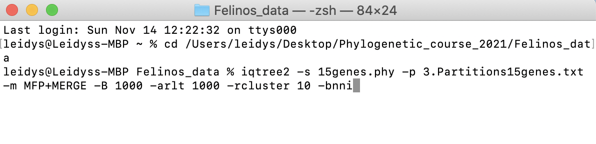
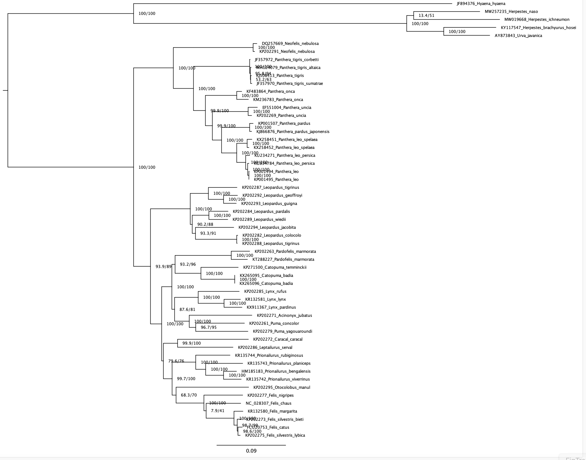

# Maximum-Likelihood Phylogenetic Inference


## **IQTREE3** 
Now that we learned how to use IQ-TREE for model and partition search, we will move on to doing phylogenetic inference with it.

**Command line instructions and Tree inference**

Tree Inference is one of the most frequently used features of IQ-TREE and allows users to carry out phylogenetic analysis on a multiple sequence alignment (MSA). In the most basic case, no more than an MSA file is required to submit the job. Without further input, IQ-TREE will run with the default parameters and auto-detect the sequence type as well as the best-fitting substitution model. Additionally, Ultrafast Bootstrap ([Hoang et al., 2018](https://academic.oup.com/mbe/article/35/2/518/4565479)) and the SH-aLRT branch test ([Guindon et al., 2010](https://academic.oup.com/sysbio/article/59/3/307/1702850)) will be performed.

<!--
Go into the iqtree folder in your terminal as you did for the [previous tutorial](../ModelSelection/Readme.md#Running-ModelFinder-with-IQ-TREE)
-->

**Command reference**

`iqtree3`: will call the executable

`-s <Alignment-file.phy>`: this option points your alignment to the program.

`-p <Partition-file>`: is your partition file, each partition to have its own evolution rate.

`-m MFP+MERGE`: like the option `MF+MERGE` that we used last time, but actually does phylogenetic inference with the found best models for the best partitioning scheme.

`-B`: will perform Ultrafast Boostrap.

`-alrt`: will perform the SH-aLRT test.

`-bnni`: reduce the risk of overestimating branch supports with UFBoot due to severe model violation.

First make sure you're in the folder with your data (alignment) and the gene partitions file.

1. Now you can try to run a simple analysis by entering


```
iqtree3 -s ATP6_COI_CytB_ND5.phy
```


In this case, IQTREE3 will infer a tree from a sequence alignment (file.phy) with the best-fit model automatically selected by ModelFinder.


2. However, to find best partition scheme by possibly merging partitions, followed by tree inference and branch support run an analysis by entering

```
iqtree3 -s ATP6_COI_CytB_ND5.phy -p Gene_partitions.txt -m MFP+MERGE -B 1000 -alrt 1000 --prefix tree_inference -bnni
```


You should have something similar to this:

<p align="center"></p>

**Congratulations! now that you have run the analyses, compare the results.**


**Output Files to check**

   Suffix	     
   
- `.iqtree`	     Full result of the run, this is the main report file.

- `.log`	       Run log.

- `.treefile`	   Maximum likelihood tree in NEWICK format, can be visualized with treeviewer programs.

- `.ufboot`      Bootstrap trees.

- `.best_scheme.nex` best partitioning scheme.


# Tree visualization


Open the file `.treefile` retrieved from IQTREE3 and check the support values. You can open such a file in FigTree. The phylogeny should look more or less as shown in the next screenshot.

<p align="center"></p>

The tree is rooted by default on the first taxon in your dataset or on the longest branch in the dataset. In our case we should reroot the tree on the branch leading to *Hyaena and mongooses* (which is our outgroup). In FigTree, click on the branch leading to *Hyaena and mongooses* to select it, and then click on the "Reroot" button in FigTree.

You also need to make the branch support visible. This can be done by going to the tab Branch Labels. Under the Display option, choose "labels". This will make the branch support visible. First number is the SH-aLRT and the second number is UFBoot value.

**Questions**

1. *Are the UFBoot2 values higher/lower compared to those recovered from the SH-like in IQTREE?*

2. *How are the nodes/relationships supported?*

3. *Take a look at the best partitioning scheme. What are the merged partitions? Can you see any similarity pattern beween the merged partitions?*
